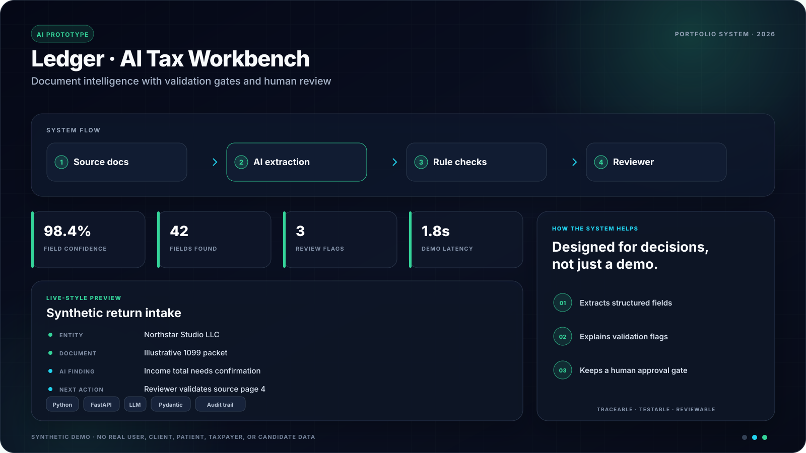

# Ledger — AI Tax Platform (Prototype)

<!-- portfolio-showcase:start -->

  

<strong>Portfolio preview:</strong> all names, records, metrics, and scenarios shown above are synthetic. No real user or customer data is included.

<!-- portfolio-showcase:end -->

**Live:** https://tax-platform-prototype-pi.vercel.app

A clickable frontend prototype for the AI Engineer case study. Covers three challenges:

- **01 — Source Document Traceability**: every number on the return traces back to its source document, exact box/page, and the calculation applied.
- **07 — An Actionable Dashboard**: a work queue ranked by "what should I work on right now," not a reporting dashboard.
- **08 — Clickable vs. Editable**: one consistent visual language for every field state (AI-extracted, verified, editable, needs-approval, locked).

**Run it:** open `index.html` in any browser. No build, no server, no dependencies.

**Important:** all taxpayer data is synthetic. This interface is a product-design prototype, not tax preparation software or tax advice.

---

## The three challenges, and where to look

### 07 — Dashboard (landing page)
The dashboard answers "what do I work on now." The queue is **ranked by real logic** (`priorityScore`) over the mock data — overdue deadlines, blocking issues, and human decisions owed float to the top. Reason chips on each row say *why* it's ranked where it is. Filters (Due soon / Blocked / Approvals) re-run the ranking. Switch the role dropdown to **Marcus (Manager)** and the queue changes: returns awaiting *his* sign-off jump to the top, because that's what's blocking his team.

**Holds at scale:** the book of business is ~208 returns, not a handful. The dashboard shows only the ranked top 8 (with a total count and "View all"); the **Returns** tab has live search (client / ID / type), status filters, and pagination (25/page), so the design is tested against real volume — which is exactly the "usable when someone owns hundreds of returns" requirement.

### 01 — Source traceability (open any return → click a line)
Click a field and the right rail shows the full chain: **value → source document → exact location → calculation**. Documents are rendered (a real W-2 layout, 1099 line items) with the source box/line **highlighted**. The calculation box shows the actual math (e.g. proceeds − basis = gain, or the SALT cap being applied). Confidence is shown per field.

### 08 — Affordance system (woven through, plus a reference page)
Five states, **defined once** (`STATES`) and reused everywhere:

| State | Meaning | What you can do |
|---|---|---|
| ✦ AI extracted | Model pulled it, unchecked | Verify / Edit / Flag |
| ✓ Verified | Human confirmed vs. source | Reopen / History |
| ✎ Editable | Directly changeable | Edit / Mark verified |
| ◷ Needs approval | Change awaiting sign-off | Approve (manager only) |
| ⛢ Locked | Statutory / filed | Nothing — reason shown |

Color, tag, and **available buttons** all change with state. Role gates the rest (a preparer can't approve). See the "Interaction system" tab for the full reference.

---

## What's real vs. simulated

**Real (actually working):**
- The dashboard prioritization ranking, filters, and role-aware queue.
- Search, status filtering, and pagination over ~208 returns (real, running against the generated dataset).
- The traceability drill-down: click any field → its source doc, highlighted location, and calculation.
- The affordance system: state → color/tag/actions, gated by role.
- State transitions (e.g. clicking "Verify" flips a field to Verified and updates the UI).
- A couple of runnable `console.assert` self-checks on the ranking logic (open the console).

**Simulated (fabricated, no backend):**
- 4 returns are hand-authored with rich detail; the other ~204 are procedurally generated from a seeded PRNG (stable across reloads). Each generated return gets its own varied values and a **matching source document** — W-2 wages/employer/withholding, 1099-INT interest/bank, filing status — so opening any return shows a unique, self-consistent trace, not a shared template.
- All returns, clients, documents, and dollar figures are hardcoded.
- AI extraction and confidence scores are made up — no OCR or model runs.
- No auth: the role dropdown swaps a state variable, not a real permission system.
- Buttons like Edit / Flag show a toast instead of a real editor or workflow.
- "Today" is pinned to 2026-08-05 so the due-date math is stable for the demo.

---

## Decisions worth explaining

- **One product, not three screens.** The challenges compose: a ranked dashboard drills into a return, and inside the return, every field carries both its traceability chain and its affordance state. That's how a real user would move through it.
- **Traceability as a chain, not a link.** A single "source" link would answer *where* but not *how a number was derived*. The 4-step chain (value → source → location → calculation) is what lets a CPA trust the number without re-deriving it — which is the whole point of the challenge.
- **Affordance = color + tag + actions, together.** Color alone is ambiguous and fails for color-blind users, so state is always carried by an icon+text tag too, and it changes the buttons you get. Defined once so it can't drift screen to screen.
- **Ranking is transparent.** The dashboard never just says "priority: high" — every row shows the reasons behind its rank, so the AI's ordering is auditable, not a black box.
